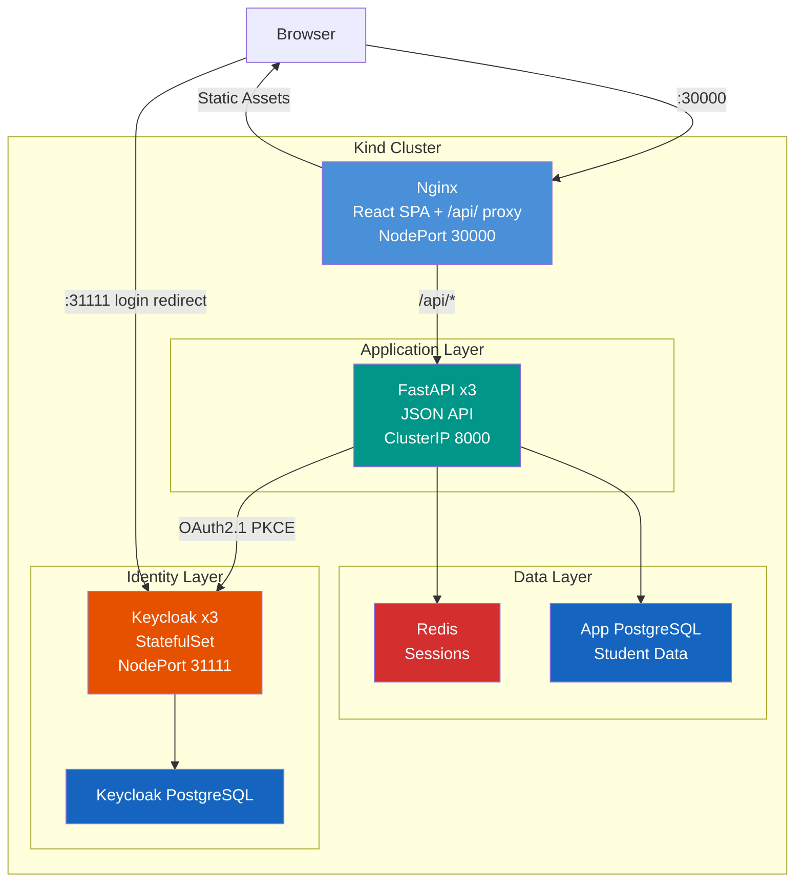
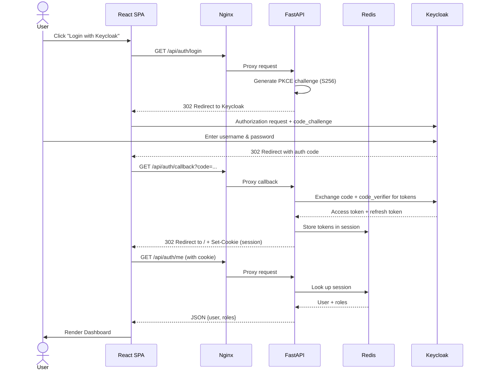
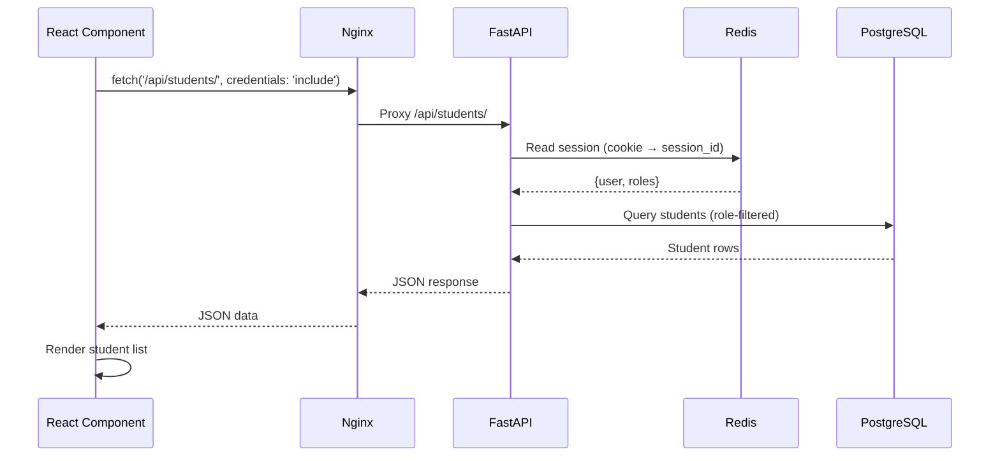
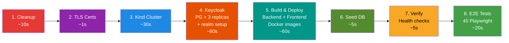
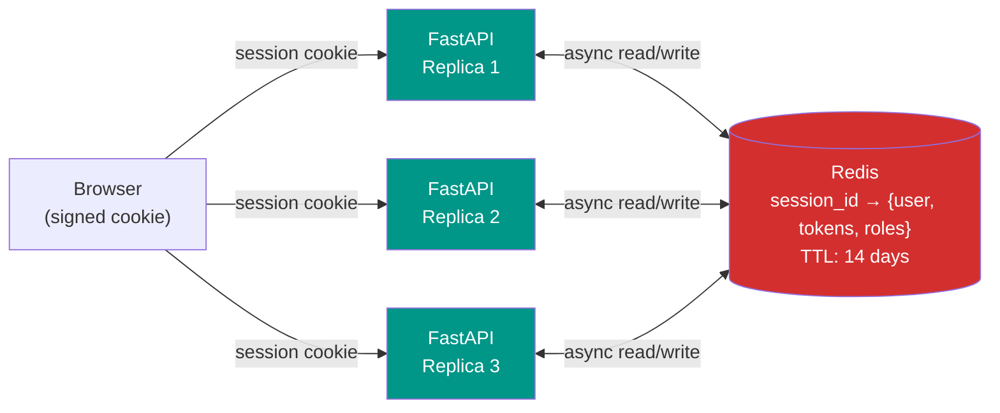
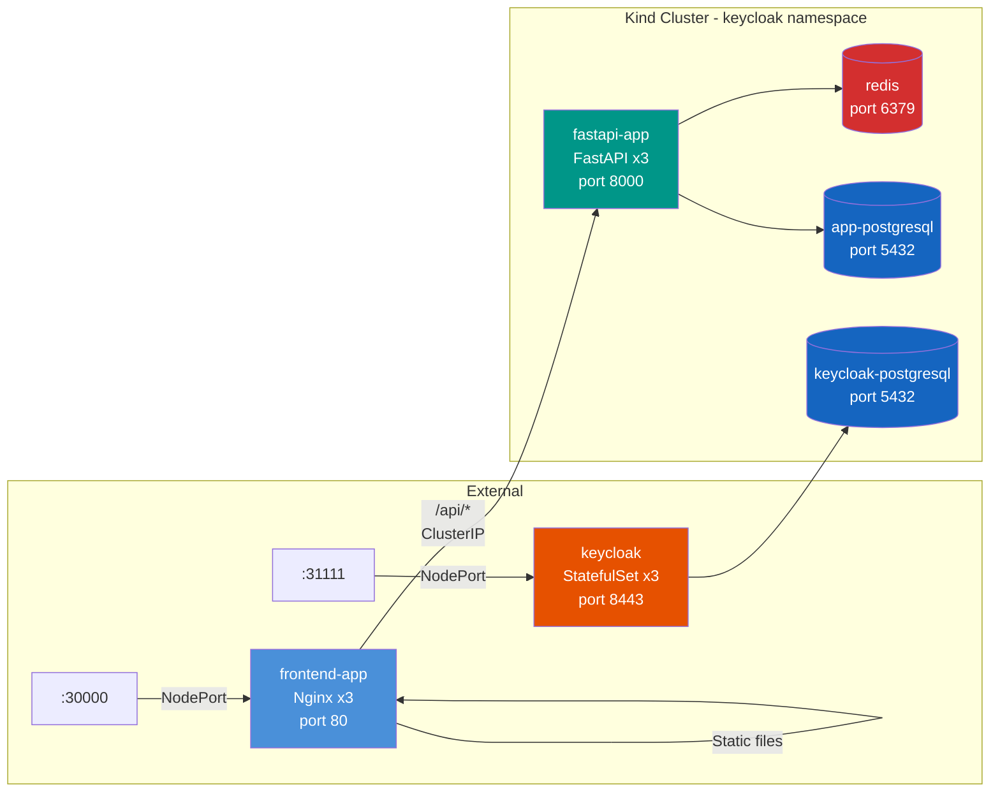

# Student Management System


OAuth2.1-secured Student Management System with **Keycloak** as the identity provider, a **React 19** single-page application frontend, and a **FastAPI** JSON API backend — all deployed in a **Kind** (Kubernetes-in-Docker) cluster.

---

## Table of Contents

- [Architecture Overview](#architecture-overview)
- [How It Works](#how-it-works)
- [Tech Stack](#tech-stack)
- [Prerequisites](#prerequisites)
- [Quick Start (One Command)](#quick-start-one-command)
- [Step-by-Step Setup](#step-by-step-setup)
- [Running E2E Tests](#running-e2e-tests)
- [Local Development](#local-development)
- [Project Structure](#project-structure)
- [API Reference](#api-reference)
- [Authentication & Authorization](#authentication--authorization)
- [Kubernetes Architecture](#kubernetes-architecture)
- [Test Users](#test-users)
- [Troubleshooting](#troubleshooting)
- [Scripts Reference](#scripts-reference)

---

## Architecture Overview

The system uses the **BFF (Backend-for-Frontend)** pattern. The React SPA and the FastAPI API are served through a single Nginx entry point, keeping OAuth tokens server-side and eliminating CORS complexity.



**Key design decisions:**

- **Same-origin cookies**: Nginx serves both the SPA and proxies API calls, so session cookies flow naturally — no CORS, no `SameSite` issues
- **Server-side tokens**: OAuth access/refresh tokens are stored in Redis sessions, never exposed to the browser
- **Multi-replica ready**: Redis-backed sessions ensure any of the 3 FastAPI replicas can handle any request
- **PKCE (S256)**: Authorization Code flow with Proof Key for Code Exchange prevents authorization code interception

---

## How It Works

### Authentication Flow



### Request Flow (After Login)



---

## Tech Stack

| Layer | Technology | Version |
|-------|-----------|---------|
| **Frontend** | React + TypeScript | 19.0 / 5.7 |
| **Build Tool** | Vite | 6.0 |
| **Routing** | React Router | 7.1 |
| **CSS** | CSS Custom Properties | — |
| **Reverse Proxy** | Nginx | 1.27 |
| **Backend** | FastAPI (Python) | 0.115 |
| **OAuth Client** | Authlib | 1.4 |
| **ORM** | SQLAlchemy | 2.0 |
| **Session Store** | Redis (async) | 5.0+ |
| **Database** | PostgreSQL | — |
| **Identity Provider** | Keycloak | 26.5 |
| **Container Runtime** | Docker | — |
| **Orchestration** | Kubernetes (Kind) | 1.35 |
| **E2E Testing** | Playwright | 1.49 |

---

## Prerequisites

1. **Docker Desktop** (or Docker Engine)
2. **Kind** — `brew install kind` or [kind.sigs.k8s.io](https://kind.sigs.k8s.io/)
3. **kubectl** — `brew install kubectl`
4. **Python 3.12+** — `brew install python@3.12`
5. **Node.js 22+** — `brew install node`
6. **OpenSSL** — usually pre-installed on macOS/Linux

7. **Hosts file entry** — add this line to `/etc/hosts`:
   ```
   127.0.0.1  idp.keycloak.com
   ```

8. **Playwright browsers** (installed automatically on first run, or manually):
   ```bash
   cd frontend && npx playwright install chromium
   ```

---

## Quick Start (One Command)

This single command will clean any existing cluster, build everything from scratch, deploy to Kubernetes, and run all 45 E2E tests:

```bash
./scripts/clean-deploy-test.sh
```

**What it does (8 phases):**



**On success you'll see:**
```
╔══════════════════════════════════════════════╗
║   All Tests Passed!                          ║
╚══════════════════════════════════════════════╝

  Frontend:  http://localhost:30000
  Keycloak:  https://idp.keycloak.com:31111
  Test report: frontend/playwright-report/index.html
```

---

## Step-by-Step Setup

If you prefer to set up components individually:

### 1. Infrastructure Setup

```bash
# Generate TLS certs, create Kind cluster, deploy Keycloak, setup realm
./setup.sh
```

This creates:
- Self-signed CA + TLS certificates for `idp.keycloak.com`
- Kind cluster with NodePort mappings (31111, 30000, 32000)
- Keycloak namespace with PostgreSQL + Keycloak StatefulSet (3 replicas)
- `student-mgmt` realm with OAuth client + 3 test users
- Python virtual environment + Node.js dependencies

### 2. Build & Deploy Application

```bash
# Build backend + frontend Docker images, deploy to Kind, seed DB
./scripts/build-test-deploy.sh --deploy-only
```

### 3. Run Tests

```bash
# Run all 45 E2E tests against the deployed app
./scripts/build-test-deploy.sh --test-only
```

### 4. Teardown

```bash
# Delete cluster, remove certs, clean build artifacts
./cleanup.sh
```

---

## Running E2E Tests

### Against Deployed App (Kind cluster)

```bash
cd frontend
APP_URL=http://localhost:30000 npx playwright test
```

### Run Specific Test File

```bash
cd frontend
APP_URL=http://localhost:30000 npx playwright test tests/e2e/auth.spec.ts
```

### Run Specific Test by Name

```bash
cd frontend
APP_URL=http://localhost:30000 npx playwright test -g "admin can log in"
```

### View HTML Test Report

```bash
cd frontend
npx playwright show-report
```

### Test Suites

| File | Tests | What It Covers |
|------|-------|----------------|
| `auth.spec.ts` | 7 | Login (3 roles), logout, session persistence |
| `students.spec.ts` | 14 | Student CRUD + role-based access (admin/staff/student) |
| `departments.spec.ts` | 12 | Department CRUD + role-based access |
| `navigation.spec.ts` | 4 | Navbar links, dashboard cards, list-to-detail |
| `validation.spec.ts` | 3 | HTML5 required field validation |
| `errors.spec.ts` | 3 | 404 pages, cross-student access denied |
| `dark-mode.spec.ts` | 3 | Toggle, localStorage persistence, CSS |
| **Total** | **45** | |

---

## Local Development

For rapid development without Kubernetes (requires Keycloak cluster running):

### Terminal 1: Backend

```bash
cd backend
source venv/bin/activate
python run.py
# API running at http://localhost:8000
```

### Terminal 2: Frontend

```bash
cd frontend
npm run dev
# React app at http://localhost:5173 (proxies /api → localhost:8000)
```

### Terminal 3: Redis (required for sessions)

```bash
docker run --rm -p 6379:6379 redis:7-alpine
```

Then open http://localhost:5173 in your browser.

The Vite dev server proxies all `/api/` requests to the FastAPI backend at localhost:8000, mimicking the Nginx proxy behavior in production.

---

## Project Structure

```
keycloak/
├── README.md                          # This file
├── CLAUDE.md                          # AI assistant instructions
├── setup.sh                           # Full infrastructure setup
├── cleanup.sh                         # Tear down everything
│
├── backend/                           # FastAPI JSON API
│   ├── app/
│   │   ├── main.py                    # FastAPI app + health endpoint
│   │   ├── routes/
│   │   │   ├── auth_routes.py         # /api/auth/* (login, callback, me, logout)
│   │   │   ├── student_routes.py      # /api/students/* (CRUD)
│   │   │   └── department_routes.py   # /api/departments/* (CRUD)
│   │   ├── schemas.py                 # Pydantic request/response models
│   │   ├── models.py                  # SQLAlchemy models (Student, Department)
│   │   ├── database.py                # DB engine + session factory
│   │   ├── dependencies.py            # Auth guards (require_authenticated, require_admin)
│   │   ├── auth.py                    # Authlib OAuth provider registration
│   │   └── session.py                 # Redis-backed ASGI session middleware
│   ├── config.py                      # Pydantic Settings (.env loading)
│   ├── run.py                         # Uvicorn entry point
│   ├── requirements.txt               # Python dependencies
│   ├── Dockerfile                     # Python 3.12-slim + CA cert
│   └── .env                           # Local dev configuration
│
├── frontend/                          # React 19 SPA
│   ├── src/
│   │   ├── App.tsx                    # Router + AuthProvider + ThemeProvider
│   │   ├── App.css                    # All styles (light/dark CSS custom properties)
│   │   ├── api/                       # API client layer
│   │   │   ├── client.ts             # fetch wrapper (credentials: include)
│   │   │   ├── auth.ts               # getMe(), logout()
│   │   │   ├── students.ts           # CRUD functions
│   │   │   └── departments.ts        # CRUD functions
│   │   ├── contexts/
│   │   │   ├── AuthContext.tsx        # User state (calls /api/auth/me on mount)
│   │   │   └── ThemeContext.tsx       # Dark mode toggle (localStorage)
│   │   ├── components/
│   │   │   ├── Navbar.tsx            # Navigation + user info + theme toggle
│   │   │   ├── ProtectedRoute.tsx    # Redirect to /login if not authenticated
│   │   │   └── AdminRoute.tsx        # Show 403 if not admin role
│   │   └── pages/                    # Route components
│   │       ├── LoginPage.tsx
│   │       ├── DashboardPage.tsx
│   │       ├── students/             # List, Detail, Form
│   │       └── departments/          # List, Detail, Form
│   ├── tests/e2e/                    # Playwright test suites (45 tests)
│   ├── nginx.conf                    # Production: /api proxy + SPA fallback
│   ├── Dockerfile                    # Multi-stage: node build → nginx
│   ├── playwright.config.ts          # Test configuration
│   ├── vite.config.ts                # Dev proxy: /api → localhost:8000
│   └── package.json                  # React 19, Vite 6, Playwright
│
├── keycloak/                          # Kubernetes manifests
│   ├── keycloak-statefulset.yaml     # Keycloak 3-replica StatefulSet
│   ├── keycloak-*.yaml               # Keycloak config, secrets, services
│   ├── postgresql/                    # Keycloak's PostgreSQL
│   ├── app-postgresql/               # Application PostgreSQL
│   ├── redis/                        # Redis (session store)
│   ├── fastapi-app/                  # Backend deployment + config
│   ├── frontend/                     # Frontend deployment + service
│   └── realm-config/
│       └── realm-setup.sh            # Creates realm, client, roles, users
│
├── cluster/
│   ├── kind-config.yaml              # Kind cluster (ports: 31111, 30000, 32000)
│   └── namespace.yaml                # 'keycloak' namespace
│
├── certs/
│   └── generate-certs.sh             # Self-signed CA + TLS for idp.keycloak.com
│
├── scripts/
│   ├── clean-deploy-test.sh          # All-in-one: clean → deploy → test
│   ├── build-test-deploy.sh          # Build + deploy + test (cluster exists)
│   ├── deploy-and-test.sh            # Alternative deploy pipeline
│   ├── run-tests.sh                  # Test runner with options
│   ├── create-test-data.py           # Seed departments + students
│   ├── wait-for-keycloak.sh          # Poll Keycloak readiness
│   └── verify-deployment.sh          # Check deployment health
│
├── plans/                            # Implementation plan documents
│   ├── 1-keycloak-oauth21-student-mgmt.md
│   ├── 2-multi-replica-deploy-auth-refactor.md
│   └── 3-react-frontend-bff-migration.md
│
└── skills/
    └── README.md                     # Technology & pattern catalog
```

---

## API Reference

### Authentication

| Method | Endpoint | Auth | Description |
|--------|----------|------|-------------|
| `GET` | `/api/auth/login` | None | Redirects to Keycloak login page |
| `GET` | `/api/auth/callback` | None | OAuth callback (exchanges code for tokens) |
| `GET` | `/api/auth/me` | Session | Returns current user + roles (or 401) |
| `POST` | `/api/auth/logout` | Session | Clears session, returns `{logout_url}` |

### Students

| Method | Endpoint | Auth | Description |
|--------|----------|------|-------------|
| `GET` | `/api/students/` | Authenticated | List students (admin/staff: all, student: own) |
| `POST` | `/api/students/` | Admin | Create student (JSON body) |
| `GET` | `/api/students/{id}` | Authenticated | Student detail (ownership check for students) |
| `PUT` | `/api/students/{id}` | Admin | Update student (JSON body) |

### Departments

| Method | Endpoint | Auth | Description |
|--------|----------|------|-------------|
| `GET` | `/api/departments/` | Authenticated | List all departments |
| `POST` | `/api/departments/` | Admin | Create department (JSON body) |
| `GET` | `/api/departments/{id}` | Authenticated | Department detail (includes students) |
| `PUT` | `/api/departments/{id}` | Admin | Update department (JSON body) |

### Health

| Method | Endpoint | Auth | Description |
|--------|----------|------|-------------|
| `GET` | `/api/health` | None | Returns `{"status": "ok"}` |

---

## Authentication & Authorization

### Role-Based Access Control (RBAC)

Three roles are defined as Keycloak client roles on the `student-app` client:

| Action | admin | staff | student |
|--------|:-----:|:-----:|:-------:|
| View all students | yes | yes | no (own only) |
| Create/edit students | yes | no | no |
| View all departments | yes | yes | yes |
| Create/edit departments | yes | no | no |
| See Add/Edit buttons in UI | yes | no | no |

### How Authorization Works

**Backend** — FastAPI declarative dependencies:
```python
@router.get("/", dependencies=[Depends(require_authenticated)])  # Any logged-in user
@router.post("/", dependencies=[Depends(require_admin)])          # Admin role only
```

**Frontend** — Route guards:
- `<ProtectedRoute>` — redirects to `/login` if no session
- `<AdminRoute>` — shows "403 Forbidden" if user lacks admin role
- Conditional UI — Add/Edit buttons hidden for non-admin roles

### Session Architecture



- `itsdangerous.Signer` prevents cookie tampering
- `redis.asyncio` for non-blocking operations
- Any of the 3 FastAPI replicas can read any session

---

## Kubernetes Architecture

### Pod Layout

| Component | Type | Replicas | Ports |
|-----------|------|----------|-------|
| Keycloak | StatefulSet | 3 | 8443 (HTTPS), 9000 (health) |
| FastAPI Backend | Deployment | 3 | 8000 |
| Frontend (Nginx) | Deployment | 3 | 80 |
| Redis | Deployment | 1 | 6379 |
| App PostgreSQL | Deployment | 1 | 5432 |
| Keycloak PostgreSQL | Deployment | 1 | 5432 |

### Service Exposure

| Service | Type | External Port |
|---------|------|---------------|
| Frontend (Nginx) | NodePort | **30000** |
| Keycloak | NodePort | **31111** |
| FastAPI Backend | ClusterIP | Internal only |
| Redis | ClusterIP | Internal only |
| PostgreSQL (both) | ClusterIP | Internal only |

### Network Flow



---

## Test Users

| Username | Password | Role | What They Can Do |
|----------|----------|------|------------------|
| `admin-user` | `admin123` | admin | Full CRUD on students and departments |
| `student-user` | `student123` | student | View own student record and all departments |
| `staff-user` | `staff123` | staff | View all students and departments (read-only) |

Keycloak admin console: https://idp.keycloak.com:31111 (admin / admin)

---

## Troubleshooting

### "Connection refused" on localhost:30000

```bash
# Check if frontend pods are running
kubectl get pods -n keycloak -l app=frontend-app

# If pods are running but port not reachable, use port-forward
kubectl port-forward -n keycloak svc/frontend-app 30000:80
```

### "idp.keycloak.com" not resolving

Ensure `/etc/hosts` contains:
```
127.0.0.1  idp.keycloak.com
```

### Keycloak login page doesn't load

```bash
# Check Keycloak pods
kubectl get pods -n keycloak -l app=keycloak

# Check logs
kubectl logs -n keycloak keycloak-0
```

### API returns 401 after login

```bash
# Check Redis is running (sessions are stored there)
kubectl get pods -n keycloak -l app=redis

# Check FastAPI logs
kubectl logs -n keycloak -l app=fastapi-app --tail=20
```

### Tests fail with "strict mode violation"

This means a Playwright selector matched multiple elements. Scope your selectors more specifically (e.g., `.navbar .badge` instead of `.badge`).

### Stale Python venv after moving directories

If you see "bad interpreter" errors:
```bash
cd backend
rm -rf venv
python3 -m venv venv
source venv/bin/activate
pip install -r requirements.txt
```

---

## Scripts Reference

| Script | Description | Usage |
|--------|-------------|-------|
| `scripts/clean-deploy-test.sh` | Full lifecycle: clean, deploy, test | `./scripts/clean-deploy-test.sh` |
| `scripts/build-test-deploy.sh` | Build + deploy + test (cluster must exist) | `./scripts/build-test-deploy.sh` |
| `scripts/build-test-deploy.sh --deploy-only` | Build + deploy, skip tests | |
| `scripts/build-test-deploy.sh --test-only` | Test already-deployed app | |
| `setup.sh` | Create cluster + Keycloak + environments | `./setup.sh` |
| `cleanup.sh` | Delete cluster + all artifacts | `./cleanup.sh` |
| `scripts/run-tests.sh` | Test runner with flags | `./scripts/run-tests.sh --deployed` |
| `scripts/verify-deployment.sh` | Check deployment health | `./scripts/verify-deployment.sh` |


<script type="module">
  import mermaid from 'https://cdn.jsdelivr.net/npm/mermaid@11/dist/mermaid.esm.min.mjs';
  mermaid.initialize({ startOnLoad: true });
  
  // This part forces Jekyll's "language-mermaid" blocks to render
  const codeBlocks = document.querySelectorAll('.language-mermaid');
  codeBlocks.forEach(block => {
    const pre = document.createElement('pre');
    pre.className = 'mermaid';
    pre.textContent = block.textContent;
    block.parentElement.replaceWith(pre);
  });
</script>
