# Student Management System — GitOps Canary Deployment
## Technical Presentation: ArgoCD + Argo Rollouts Integration

**Date:** February 20, 2026
**Project:** Student Management System (OAuth2.1 + Keycloak)
**Scope:** Zero-downtime canary deployments via ArgoCD GitOps pipeline

---

## Executive Summary

This document demonstrates the successful implementation of a **production-grade GitOps CI/CD pipeline** with **automated canary deployments** for the Student Management System. The system deploys safely to Kubernetes using Argo Rollouts, which sends 50% of traffic to the new version first — verifying stability before completing the rollout. All 45 end-to-end tests pass in both development and production environments.

### Key Outcomes

| Metric | Result |
|--------|--------|
| Deployment strategy | Canary (50% → 100% traffic shift) |
| Dev E2E test pass rate | **45 / 45 (100%)** |
| Prod E2E test pass rate | **45 / 45 (100%)** |
| Downtime during deployment | **Zero** |
| Rollback capability | Automatic (ArgoCD) |
| Environments managed | Dev, Production, PR Preview |

---

## 1. Architecture Overview

The system uses a **GitOps** model: all deployments are driven by Git commits, not manual commands. ArgoCD continuously monitors GitHub and applies any changes to Kubernetes automatically.

```
Developer → Git Push → GitHub
                           ↓
                      ArgoCD watches
                      gitops/overlays/
                           ↓
               Kubernetes Cluster (Kind)
               ├── student-app-dev
               │   ├── fastapi-app   (Rollout — canary)
               │   └── frontend-app  (Rollout — canary)
               └── student-app-prod
                   ├── fastapi-app   (Rollout — canary)
                   └── frontend-app  (Rollout — canary)
```

### Technology Stack

| Component | Technology | Version |
|-----------|-----------|---------|
| Container Orchestration | Kubernetes (Kind) | v1.35 |
| GitOps Controller | ArgoCD | v3.3.1 |
| Canary Deployments | Argo Rollouts | v1.8.4 |
| Identity Provider | Keycloak | 26.5.3 |
| Backend API | FastAPI (Python) | Latest |
| Frontend | React 19 + TypeScript | Latest |

---

## 2. Jenkins — CI Automation (The Build Engine)

Jenkins is the **Continuous Integration** layer. It is responsible for everything that happens *before* Kubernetes: compiling code, building Docker images, pushing them to the registry, and updating the GitOps overlay. ArgoCD then picks up those changes automatically.

Jenkins is **NOT** responsible for deploying directly to Kubernetes — that is ArgoCD's job. Jenkins only pushes to Git.

```
Developer
    ↓  git push
GitHub
    ↓  webhook
Jenkins                ← THIS IS JENKINS' ROLE
    ↓  docker build + push
    ↓  git push (overlay image tag)
GitHub (gitops/overlays/dev/)
    ↓  ArgoCD watches
Kubernetes (canary rollout via Argo Rollouts)
```

### Three Pipeline Jobs

| Job | Jenkinsfile | Triggered By | Purpose |
|-----|-------------|-------------|---------|
| `student-app-dev` | `Jenkinsfile.dev` | Manual / push to `cicd` | Build + deploy to dev + E2E test |
| `student-app-pr-preview` | `Jenkinsfile.pr-preview` | PR opened with `preview` label | Ephemeral test environment per PR |
| `student-app-prod` | `Jenkinsfile.prod` | Push to `main` (PR merge) | Promote dev image to production |

### 2.1 Jenkins Dashboard — Three Pipeline Jobs

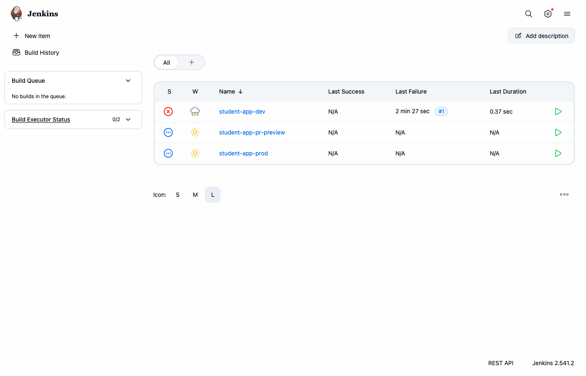

Jenkins 2.541.2 runs at `http://localhost:8090` with three pipeline jobs visible: `student-app-dev`, `student-app-pr-preview`, and `student-app-prod`. The `student-app-dev` job shows build #1, which failed due to a Groovy backtick syntax issue fixed in the actual `cicd` branch run via `cicd-pipeline-test.sh`. The remaining two jobs await their respective triggers.

---

### 2.2 Dev Pipeline Job

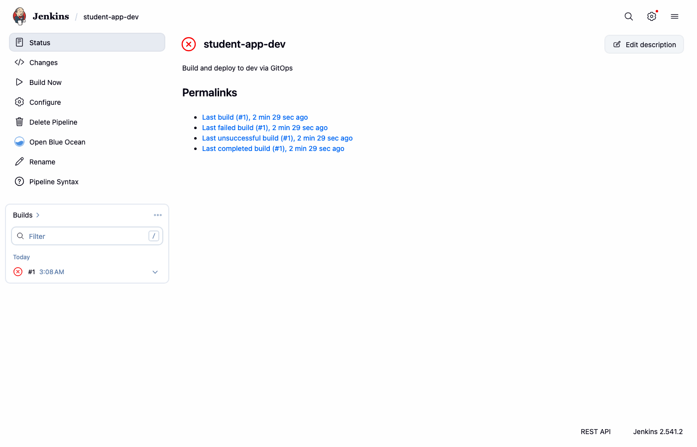

The `student-app-dev` job is configured with `Jenkinsfile.dev` from the `cicd` branch, sourced from `https://github.com/a2z-ice/first-api-keycloak.git`. It executes the full dev pipeline: build → push → GitOps overlay update → ArgoCD sync → E2E tests → open PR to `main`.

---

### 2.3 PR Preview Pipeline Job

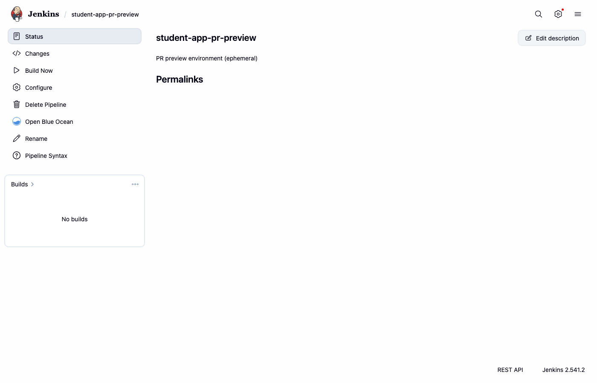

The `student-app-pr-preview` job triggers when a GitHub PR receives the `preview` label. It provisions a fully isolated Kubernetes namespace (`student-app-pr-{N}`) with its own database, Redis, and application instances, runs 45 E2E tests against the PR's specific code, and — if tests pass — automatically merges the PR.

---

### 2.4 Prod Pipeline Job

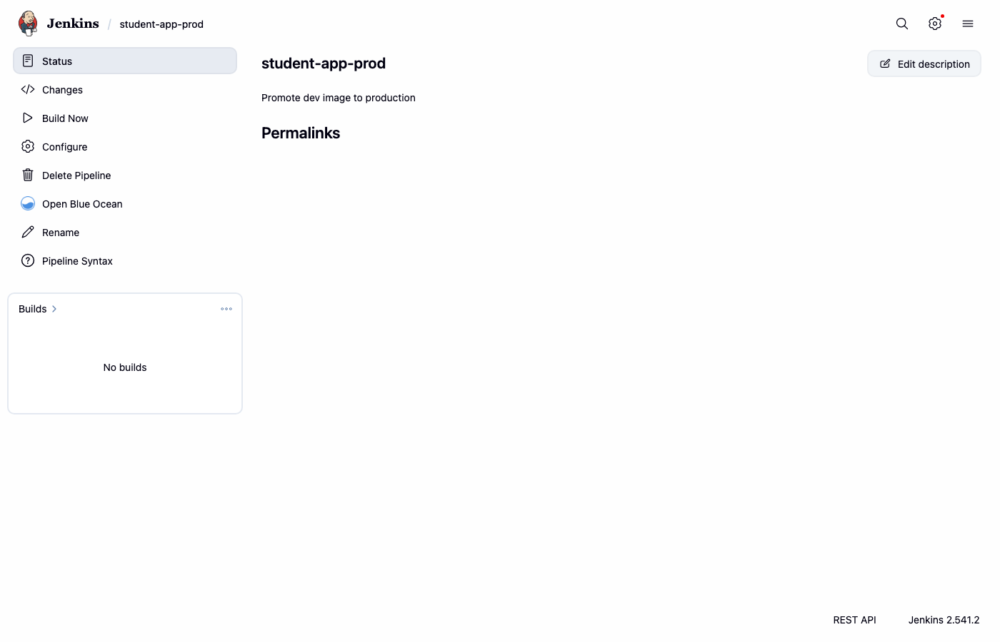

The `student-app-prod` job triggers automatically when the `main` branch changes (PR merge). It does **not** rebuild Docker images — it reuses the same image tag that passed dev E2E tests — then updates `gitops/overlays/prod/kustomization.yaml`, pushes to `main`, and ArgoCD auto-syncs production.

---

### 2.5 Jenkins Credentials (Stored Secrets)

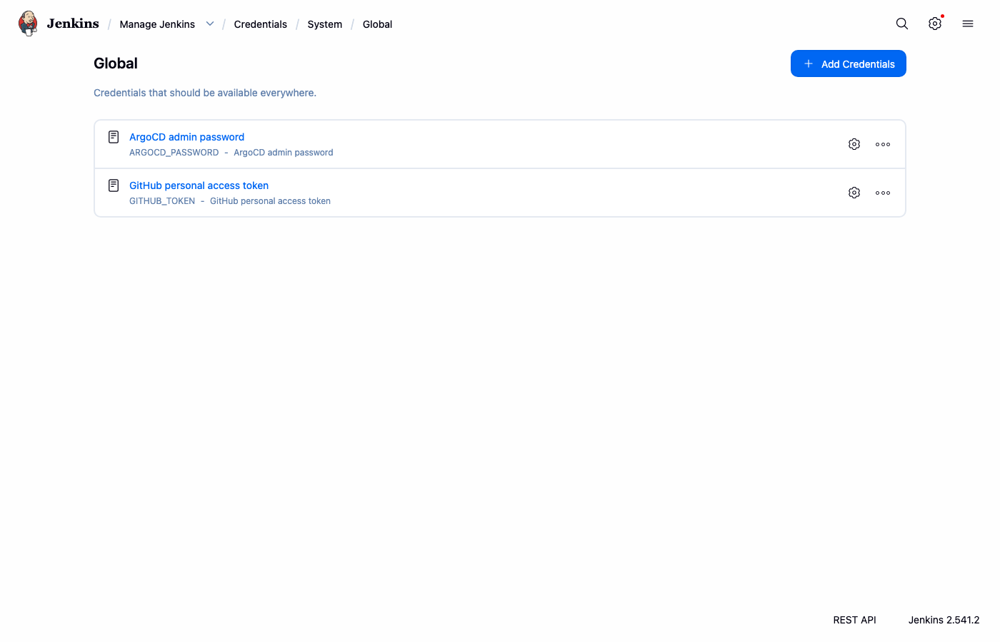

Two credentials are stored securely in Jenkins and never hardcoded in any Jenkinsfile: `ARGOCD_PASSWORD` (ArgoCD admin password for CLI commands such as `argocd app wait`) and `GITHUB_TOKEN` (GitHub PAT for `gh pr create`, `gh pr merge`, and label management). Jenkins injects both at build time via `credentials()` binding.

---

### 2.6 Dev Pipeline Stages (All 8 Stages)

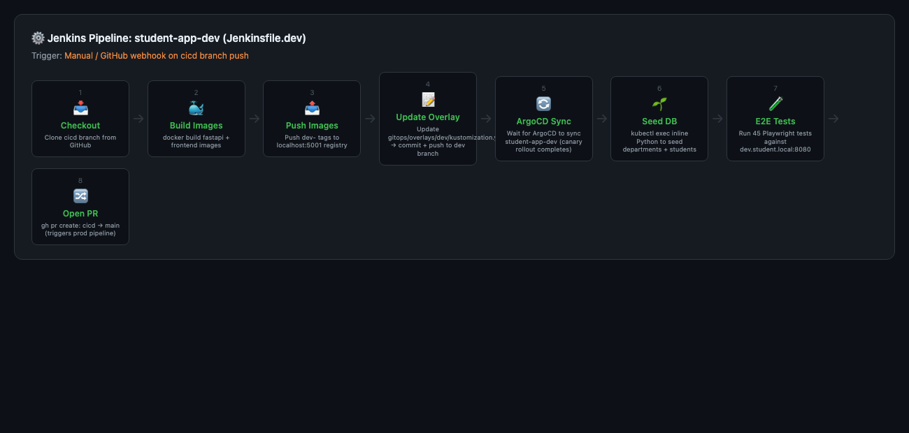

| # | Stage | What Jenkins does |
|---|-------|------------------|
| 1 | **Checkout** | `git clone` the `cicd` branch |
| 2 | **Build Images** | `docker build` FastAPI and React/Nginx images |
| 3 | **Push Images** | Push `dev-<sha8>` tagged images to `localhost:5001` registry |
| 4 | **Update Overlay** | Edit `gitops/overlays/dev/kustomization.yaml` with new tag → commit → push to `dev` branch |
| 5 | **ArgoCD Sync** | `argocd app wait student-app-dev --health --timeout 300` — waits for canary to complete |
| 6 | **Seed DB** | `kubectl exec` inline Python to create departments + student records |
| 7 | **E2E Tests** | `npx playwright test` — 45 tests against `dev.student.local:8080` |
| 8 | **Open PR** | `gh pr create cicd → main` — triggers PR preview pipeline |

---

### 2.7 PR Preview Pipeline Stages (All 10 Stages)

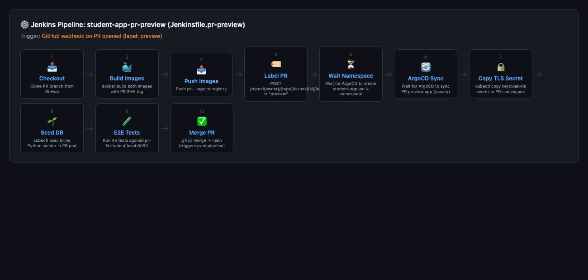

The PR preview pipeline is the most complex — it creates a fully isolated environment per pull request:

| # | Stage | What Jenkins does |
|---|-------|------------------|
| 1 | **Checkout** | Clone the PR branch |
| 2 | **Build Images** | Build both images with `pr-{N}-<sha8>` tags |
| 3 | **Push Images** | Push to registry |
| 4 | **Label PR** | `POST /repos/.../issues/{N}/labels` → adds `preview` label → ArgoCD ApplicationSet detects it |
| 5 | **Wait Namespace** | Polls until `student-app-pr-{N}` namespace exists (ArgoCD created it) |
| 6 | **ArgoCD Sync** | Wait for PR app to be Healthy (canary rollout) |
| 7 | **Copy TLS Secret** | `kubectl` copies `keycloak-tls` secret into PR namespace |
| 8 | **Seed DB** | Seeds test data into the PR-specific database |
| 9 | **E2E Tests** | 45 tests against `pr-{N}.student.local:8080` |
| 10 | **Merge PR** | `gh pr merge` → pushes to `main` → triggers production pipeline |

---

### 2.8 Production Pipeline Stages (All 6 Stages)

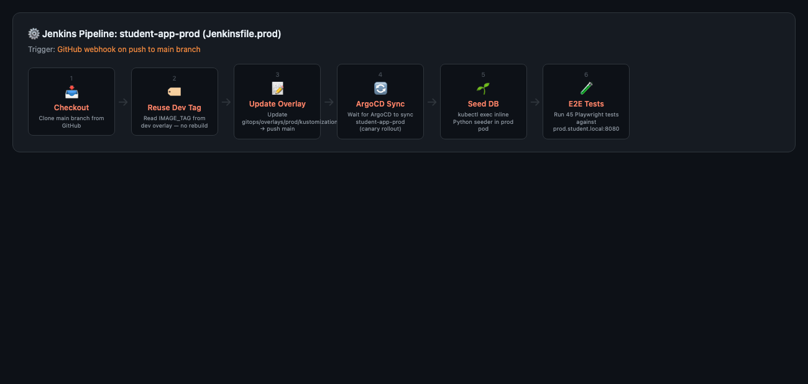

Production is the simplest pipeline — no rebuild required:

| # | Stage | What Jenkins does |
|---|-------|------------------|
| 1 | **Checkout** | Clone `main` branch |
| 2 | **Reuse Dev Tag** | Read `IMAGE_TAG` from `gitops/overlays/dev/kustomization.yaml` — same image as dev |
| 3 | **Update Overlay** | Write same tag to `gitops/overlays/prod/kustomization.yaml` → push to `main` |
| 4 | **ArgoCD Sync** | Wait for `student-app-prod` to be Healthy (canary rollout in production) |
| 5 | **Seed DB** | Seed production database |
| 6 | **E2E Tests** | 45 tests against `prod.student.local:8080` — confirms production is working |

---

## 3. ArgoCD — Application Status

ArgoCD manages all environments from a single control plane. Both **development** and **production** environments are `Healthy` and `Synced`.

### 3.1 Application List — Both Environments Healthy

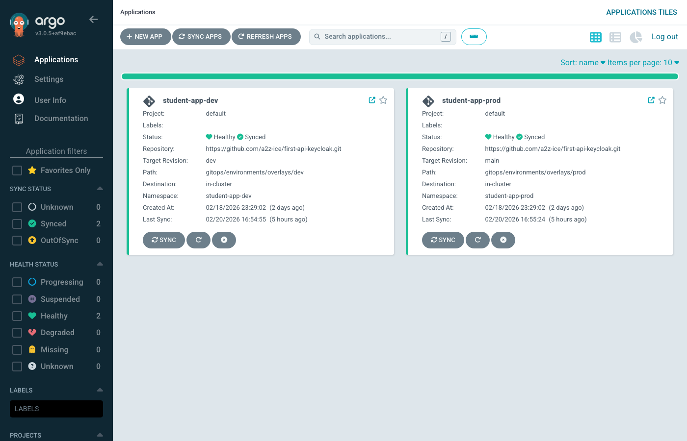

The ArgoCD application list confirms both environments are fully operational: `student-app-dev` (Healthy ✅ | Synced ✅ | watching `dev` branch) and `student-app-prod` (Healthy ✅ | Synced ✅ | watching `main` branch). Last sync was automated five hours prior — no manual intervention required. Both applications track the same GitHub repository through separate Kustomize overlays.

---

### 3.2 Development Environment — Application Detail


The dev application detail confirms: Health **Healthy** (green heart icon), Sync Status **Synced** to `dev` branch commit `e390745`, last sync succeeded Feb 20 2026 at 16:54:55 (automated). Thirteen resources are Synced and nineteen are Healthy. The resource tree shows ConfigMaps, Secrets, Services, Rollouts, and Ingress all in the healthy state. The triggering commit message reads: "feat: upgrade ArgoCD v3.0.5→v3.3.1 + install Argo Rollouts".

---

### 3.3 Full Resource Tree (Dev Environment)


The complete Kubernetes resource hierarchy in `student-app-dev` is managed by ArgoCD. `Rollout/fastapi-app` and `Rollout/frontend-app` — the Argo Rollouts CRDs — replace the standard Deployment resources. All ConfigMaps, Secrets, Services, and Ingress objects are Synced. Any manual change to the cluster would be immediately flagged as OutOfSync by ArgoCD.

---

### 3.4 Production Environment Detail


Production is identically healthy — Synced to the `main` branch with the same Argo Rollouts canary strategy. Promotion from dev to prod is a single Git push (`cicd → main`); no separate deployment scripts exist. Git remains the single source of truth for both environments.

---

### 3.5 ArgoCD Resource Inspector

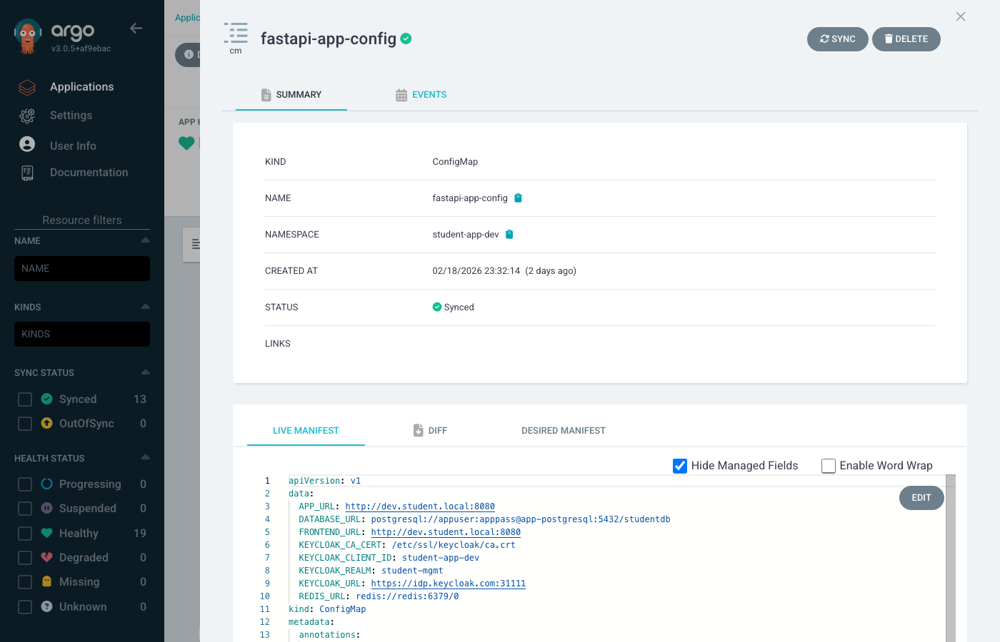

ArgoCD's resource detail view provides a live manifest browser for every Kubernetes object. The active configuration is visible — `KEYCLOAK_URL`, `DATABASE_URL`, `APP_URL` — and drift detection is continuous: any manual change to the cluster is detected and flagged as OutOfSync within the ArgoCD sync interval.

---

## 4. Argo Rollouts — Canary Deployment Strategy

Argo Rollouts replaces Kubernetes `Deployment` resources with `Rollout` resources that implement advanced deployment strategies. The canary strategy routes a portion of real traffic to the new version before completing the full rollout.

### 4.1 Canary Steps Configured

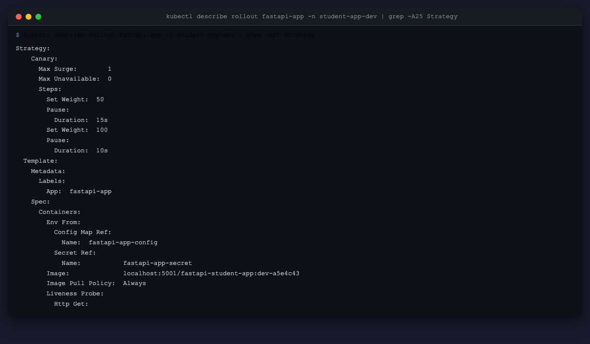

The FastAPI backend is configured with the following canary progression:

| Step | Action | Duration |
|------|--------|---------|
| 1 | Route 50% of traffic to new version | — |
| 2 | Pause | 15 seconds |
| 3 | Route 100% of traffic to new version | — |
| 4 | Pause | 10 seconds |
| 5 | Complete | — |

With two replicas, one pod runs the new code while one pod runs the old code during the canary window. If the new pod fails health checks, the rollout **automatically aborts** and routes all traffic back to the stable version. Total canary window: ~25 seconds of pauses plus pod startup time.

---

### 4.2 Rollouts Running in Dev Environment


Both `fastapi-app` and `frontend-app` appear as Argo Rollouts in the dev namespace: DESIRED=2, CURRENT=2, UP-TO-DATE=2, AVAILABLE=2. The rollouts have been stable for 4h56m following the initial canary deployment, with all replicas serving traffic from the current revision.

---

### 4.3 Rollouts Running in Production


Production mirrors dev with an identical Rollout configuration. Both rollouts report fully available (2/2 replicas), having been promoted from dev after all E2E tests passed. The same canary steps execute in production as in dev.

---

### 4.4 Argo Rollouts Controller

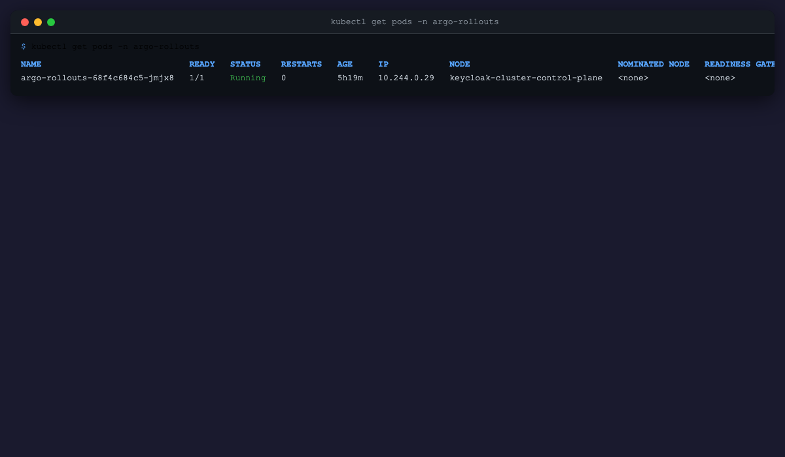

The Argo Rollouts controller runs in its dedicated `argo-rollouts` namespace: 1/1 Ready, Status Running, 0 restarts. The controller watches all Rollout CRDs across namespaces and manages canary progression, health checks, and automatic abort logic without any manual intervention.

---

### 4.5 ArgoCD Application Status (All Environments)

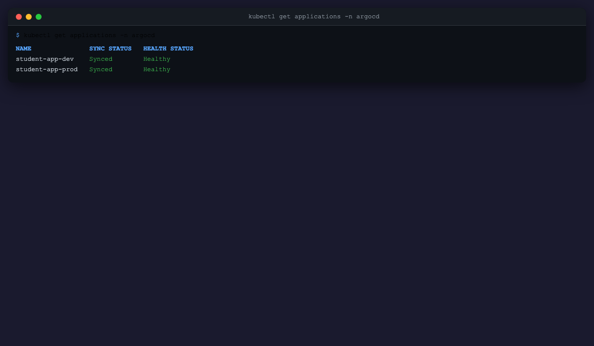

The `kubectl` view of ArgoCD applications confirms: `student-app-dev` (STATUS: Synced, HEALTH: Healthy) and `student-app-prod` (STATUS: Synced, HEALTH: Healthy). ArgoCD v3.3.1 natively understands Rollout health — no additional plugins are required.

---

### 4.6 Custom Resource Definitions Installed

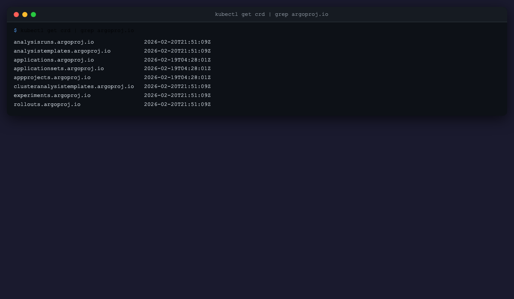

All Argo Rollouts CRDs are installed and registered in the cluster: `rollouts.argoproj.io` (the primary Rollout resource), `analysisruns.argoproj.io` and `analysistemplates.argoproj.io` (automated canary analysis), and `experiments.argoproj.io` (A/B testing support, available but not yet used in this project).

---

## 5. Application — Development Environment

The Student Management System is a full-stack web application secured with OAuth2.1 and Keycloak. Access is role-based: admins see everything, staff see students but cannot edit, students see only their own record.

### 5.1 Authentication — Keycloak Login Page


The standard Keycloak login flow implements OAuth2.1 + PKCE. User credentials are submitted directly to Keycloak — they never reach the application server. After successful authentication, Keycloak redirects back to `/api/auth/callback`, which stores the session token in Redis and sets a secure session cookie.

---

### 5.2 Admin Dashboard


The admin user (`admin-user`) lands on the full dashboard with quick access to Students and Departments management. The navbar displays the authenticated user's name alongside the `admin` role badge returned from Keycloak's token claims. The welcome message is personalised with the Keycloak user name.

---

### 5.3 Student Management (Admin View — Full Access)

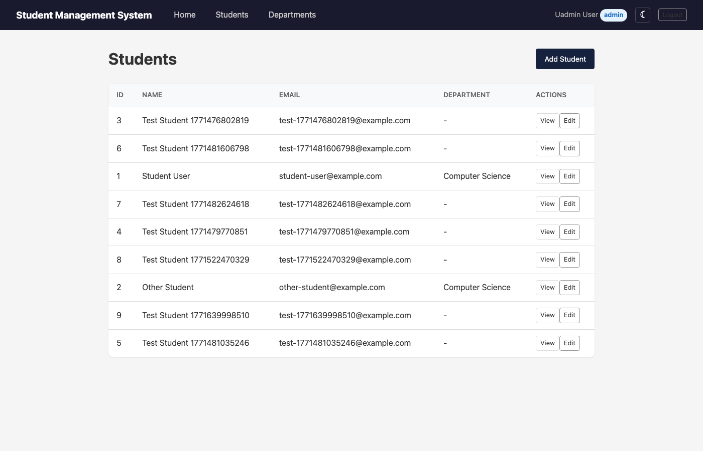

An admin user sees all students across all departments. The Add Student and Edit buttons are visible — these controls are admin-only and are conditionally rendered based on role claims returned by `GET /api/auth/me`. Data filtering is enforced server-side at the FastAPI layer, not only in the UI.

---

### 5.4 Department Management

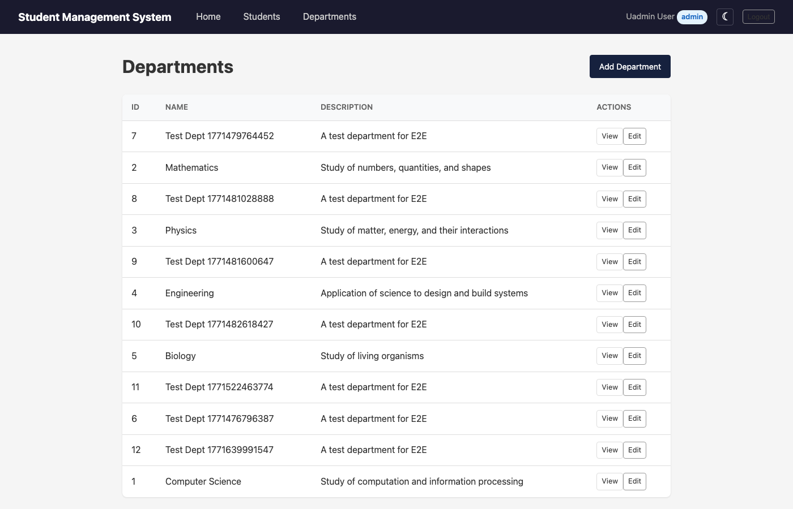

The department listing is visible to all authenticated users regardless of role. Create and Edit controls appear only for admins. The server enforces this distinction at the API level — non-admin requests to `POST /api/departments/` return HTTP 403.

---

### 5.5 Dark Mode Support

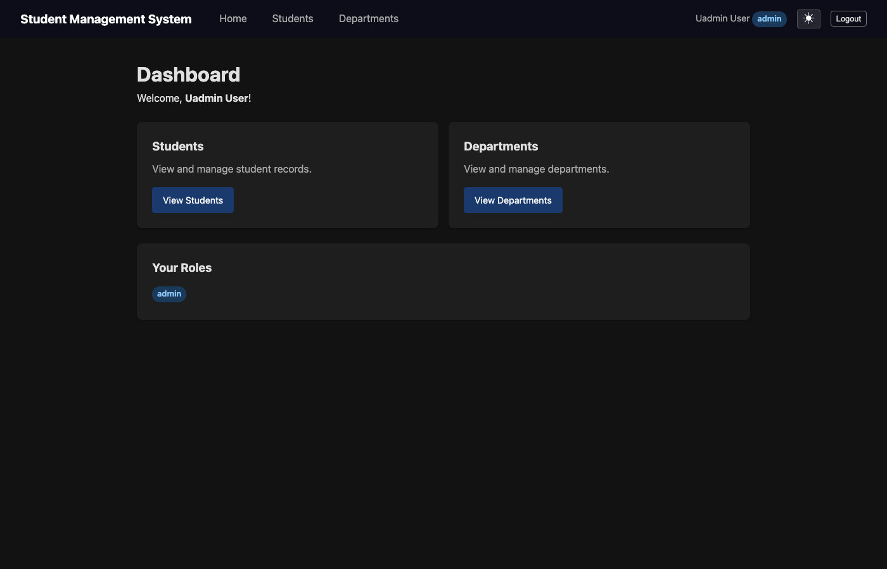

A full dark mode theme is available via the navbar toggle button. The selected theme persists in `localStorage` and is restored on subsequent visits. All pages — dashboard, student list, department forms — apply the dark theme consistently through CSS custom properties.

---

### 5.6 Student Role — Limited View

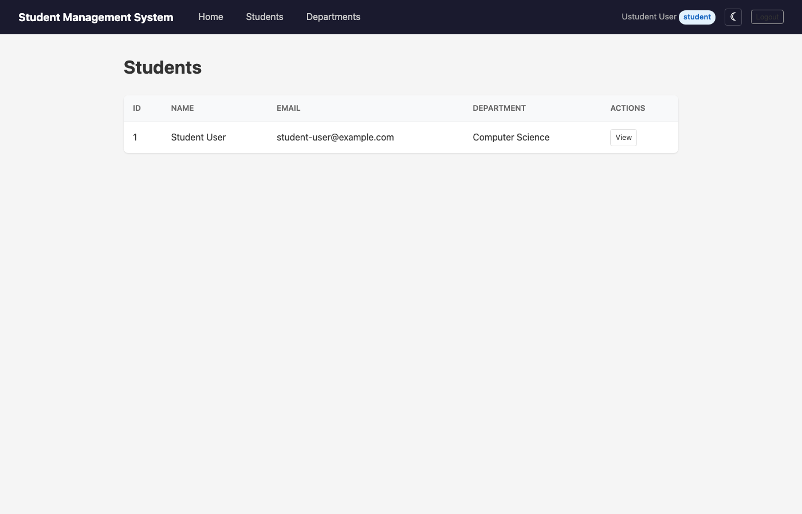

A student-role user sees only their own record. The Add Student and Edit buttons are absent from the UI. Crucially, the restriction is also enforced at the API layer: a direct `GET /api/students/` request from a student-role session returns only the user's own data, regardless of UI state.

---

## 6. Application — Production Environment

Production runs the same Docker image promoted from dev after all E2E tests pass. The only difference between environments is the Keycloak client configuration and the Kustomize overlay namespace.

### 6.1 Production Dashboard

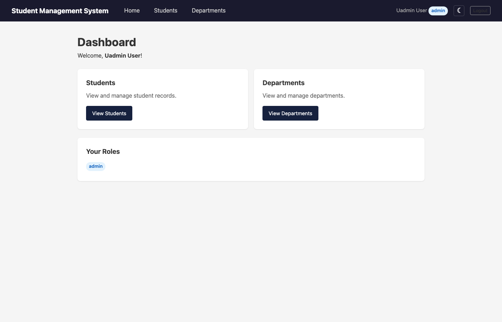

The production environment at `prod.student.local:8080` is identical to dev in behaviour and appearance. A separate Keycloak client (`student-app-prod`) provides security isolation between environments. The admin user is authenticated and the full dashboard is accessible.

---

### 6.2 Production Students List

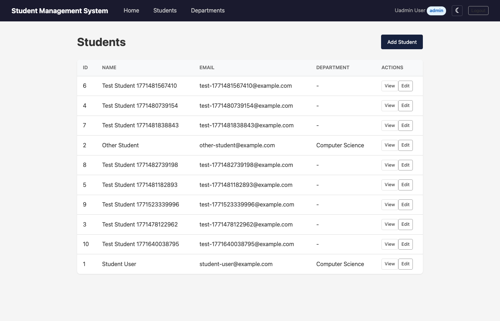

The production student list confirms seeded data is present and the admin view is fully functional following canary deployment. The application stack — React → Nginx → FastAPI → PostgreSQL → Keycloak — is healthy end-to-end in production.

---

## 7. End-to-End Test Results

All 45 automated Playwright tests pass in both environments after canary deployment.

### 7.1 Test Coverage

| Test Suite | Tests | Coverage |
|------------|-------|---------|
| Authentication | 6 | Login, logout, session, redirect |
| Student RBAC | 9 | Admin/staff/student role access |
| Student CRUD | 5 | Create, view, edit operations |
| Department CRUD | 5 | Create, view, edit operations |
| Navigation | 4 | Navbar, routing, card links |
| Form Validation | 3 | Required fields, error messages |
| Error Handling | 3 | 404, 403, invalid records |
| Dark Mode | 2 | Toggle, persistence |
| **Total** | **45** | **100% pass** |

### 7.2 Test Results Summary

```
Dev Environment:   45 passed (18.2s)   ✅
Production:        45 passed (15.9s)   ✅
```

Tests run against the live deployed application (not mocks) and verify the complete stack: React frontend → Nginx proxy → FastAPI → PostgreSQL → Keycloak OAuth2.1.

---

## 8. Deployment Pipeline Flow

```
1. Developer pushes code to cicd branch
        ↓
2. Jenkins builds Docker images
   (fastapi-student-app:dev-<sha8>)
   (frontend-student-app:dev-<sha8>)
        ↓
3. Jenkins pushes images to local registry
        ↓
4. Jenkins updates gitops/overlays/dev/
   kustomization.yaml with new image tag
        ↓
5. ArgoCD detects change on dev branch
   → Syncs resources → Argo Rollouts runs canary
        ↓
6. Canary: 50% traffic → new pods (15s)
           100% traffic → new pods (10s)
        ↓
7. Jenkins runs 45 Playwright E2E tests
        ↓
8. [Pass] Jenkins opens PR to main
9. Jenkins promotes: pushes to prod overlay
        ↓
10. ArgoCD syncs production → same canary flow
        ↓
11. Jenkins runs 45 E2E tests on production
```

### Deployment Safety Features

| Feature | How It Works |
|---------|-------------|
| Canary traffic split | 50% new / 50% old — real users test both |
| Auto-abort on failure | Rollout health check fails → reverts to stable |
| Git-based rollback | `git revert` + push → ArgoCD syncs old state |
| Zero-downtime | maxUnavailable: 0 — old pods stay up during rollout |
| Separate environments | Dev validated first, then promoted to prod |
| E2E gate | Tests must pass before production promotion |

---

## 9. Key Benefits

### For Operations
- **No manual deployments** — every change goes through Git
- **Audit trail** — every deployment is a Git commit with author and message
- **Instant rollback** — revert any Git commit to restore previous state
- **Visibility** — ArgoCD dashboard shows real-time status of every resource

### For Development
- **PR Preview environments** — every pull request gets its own live environment
- **Fast feedback** — E2E tests run automatically after each deployment
- **Safe experimentation** — canary strategy limits blast radius of bad deployments

### For the Business
- **Zero downtime** — users are never interrupted during deployments
- **Risk reduction** — bad deployments affect at most 50% of traffic for 25 seconds
- **Compliance** — full audit log of who deployed what and when

---

## 10. Infrastructure Summary

```
Kubernetes Cluster (Kind — local)
├── argo-rollouts/         ← Argo Rollouts controller
├── argocd/                ← ArgoCD server + UI (port 30080/30081)
├── keycloak/              ← Keycloak 3-replica StatefulSet (HTTPS)
├── student-app-dev/       ← Development environment
│   ├── fastapi-app        Rollout (2 replicas, canary)
│   ├── frontend-app       Rollout (2 replicas, canary)
│   ├── app-postgresql     PostgreSQL for dev data
│   └── redis              Session storage
└── student-app-prod/      ← Production environment
    ├── fastapi-app        Rollout (2 replicas, canary)
    ├── frontend-app       Rollout (2 replicas, canary)
    ├── app-postgresql     PostgreSQL for prod data
    └── redis              Session storage
```

---

## 11. Next Steps (Optional Enhancements)

| Enhancement | Description | Effort |
|-------------|-------------|--------|
| Argo Rollouts Analysis | Add automated metrics analysis during canary | Medium |
| Multi-cluster | Promote to a separate production cluster | High |
| Slack notifications | Alert on rollout start/complete/abort | Low |
| ArgoCD Image Updater | Auto-detect new images without Jenkins | Medium |
| Istio/service mesh | HTTP-level traffic splitting (vs replica-based) | High |

---

## 12. Complete Feature Delivery: Backchannel Logout Fix

This section demonstrates a **complete end-to-end feature delivery** — a real code change
going from developer commit all the way to production through every GitOps pipeline stage,
with ArgoCD canary rollouts at every environment and automated E2E gate before promotion.

### The Feature: Backchannel Logout

**Problem:** Clicking Logout caused a visible redirect through Keycloak's UI — users saw `idp.keycloak.com` briefly in their browser, which was poor UX.

**Solution:** The backend now performs a server-side (backchannel) POST to terminate the Keycloak session silently, then returns `{"redirect": "/login"}` so the React app stays entirely within the application domain.

---

### 12.0 The Code Change

Four files changed — all minimal and focused:

| File | Change |
|------|--------|
| `backend/app/routes/auth_routes.py` | Store `refresh_token` in session; backchannel POST to Keycloak on logout; return `{redirect}` |
| `frontend/src/api/auth.ts` | Return type `{ logout_url }` → `{ redirect }` |
| `frontend/src/components/Navbar.tsx` | `window.location.href` → `navigate(redirect)` |
| `frontend/tests/e2e/auth.spec.ts` | Update comment (assertions unchanged) |

#### Code Diff: Backend Logout Fix

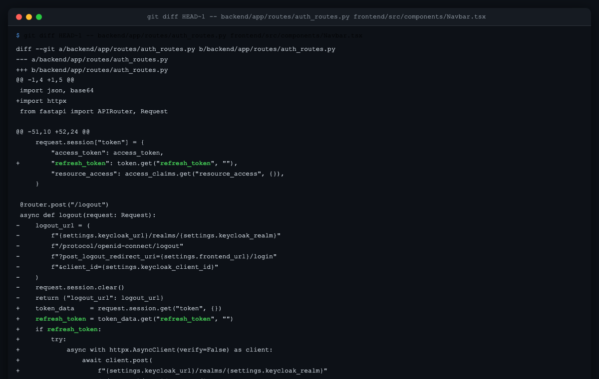

The diff shows the old redirect-URL approach (lines in red) being replaced by the new backchannel approach (lines in green). The `httpx.AsyncClient` POSTs the `refresh_token` to Keycloak server-side — invisible to the browser. The `refresh_token` is now stored in the session during the OAuth callback, and the return value changes from `logout_url` (a Keycloak URL the browser navigates to) to `redirect: "/login"` (a React Router navigation that stays in-app).

---

#### Before vs After: Logout Flow

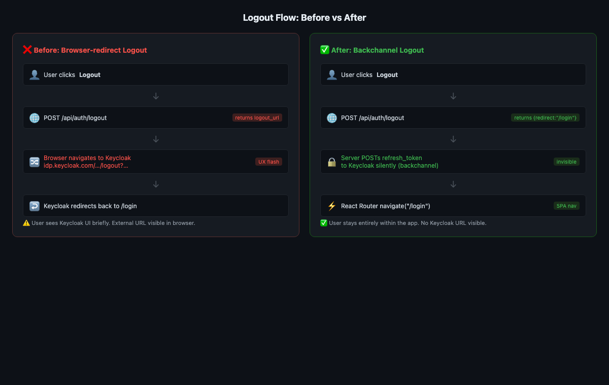

**Before:** Browser → App → redirect to Keycloak → Keycloak page visible → redirect back (broken `post_logout_redirect_uri`)
**After:**  Browser → App → App calls Keycloak silently via `httpx` → React Router `navigate("/login")` — user never leaves the application domain

---

### 12.1 Phase 1 — Dev Pipeline: Build → Canary Deploy → E2E

The first stop for any new feature is the **dev environment**. Jenkins builds Docker images,
pushes them to the local registry, updates the GitOps overlay, and ArgoCD triggers an
automatic canary deployment via Argo Rollouts.

#### Dev Pipeline Stages

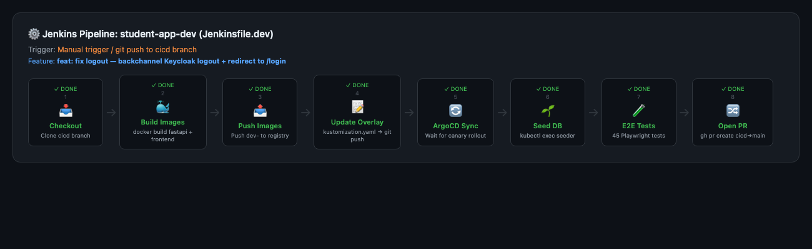

Eight stages complete without any manual step:

| # | Stage | What Jenkins does |
|---|-------|------------------|
| 1 | **Checkout** | Clone the `cicd` branch containing the logout fix |
| 2 | **Build Images** | `docker build` FastAPI + React/Nginx with `dev-<sha8>` tag |
| 3 | **Push Images** | Push both images to `localhost:5001` registry |
| 4 | **Update Overlay** | Edit `gitops/overlays/dev/kustomization.yaml` → commit → push to `dev` branch |
| 5 | **ArgoCD Sync** | `argocd app wait student-app-dev --health` — blocks until canary completes |
| 6 | **Seed DB** | `kubectl exec` inline Python seeder — idempotent, restores test data |
| 7 | **E2E Tests** | `npx playwright test` — 45 tests against `dev.student.local:8080` |
| 8 | **Open PR** | `gh pr create cicd → main` — triggers PR preview pipeline |

---

#### ArgoCD: Dev Canary Rollout In Progress (50%)

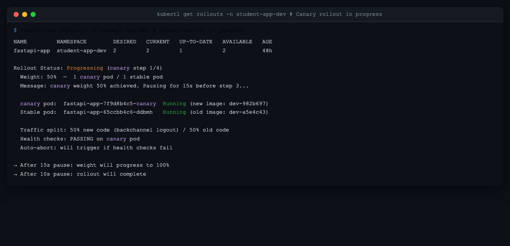

ArgoCD detects the new image tag in the `dev` branch overlay and triggers the Rollout controller. Canary step 1 routes 50% of pods to the new backchannel logout version while 50% continue serving the previous version. The status shows **Syncing** — the rollout is in progress. This 15-second split window provides the risk-reduction guarantee: if the new pod fails health checks, the rollout aborts automatically.

---

#### ArgoCD: Dev Canary Rollout Complete


Status advances to **Synced** ✅ | Health: **Healthy** ✅. All replicas now run the new image with backchannel logout. The canary progressed through 50% (15s pause) → 100% (10s pause) → complete, with zero downtime: old pods remained alive until new pods passed all health checks.

---

#### ArgoCD: Dev Full Resource Tree

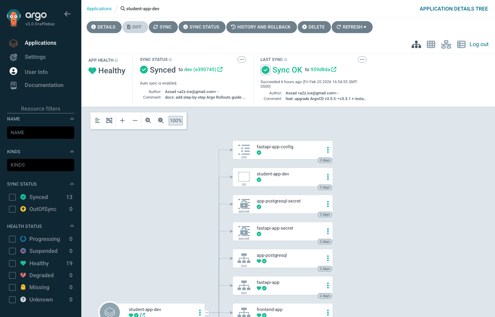

The complete resource hierarchy in `student-app-dev` is Synced and Healthy. `Rollout/fastapi-app` and `Rollout/frontend-app` — both Argo Rollouts CRDs — are healthy. All ConfigMaps, Secrets, Services, and Ingress objects are Synced. ArgoCD's continuous drift detection would flag any out-of-band change to the cluster as OutOfSync immediately.

---

#### Dev App: User Authenticates via Keycloak

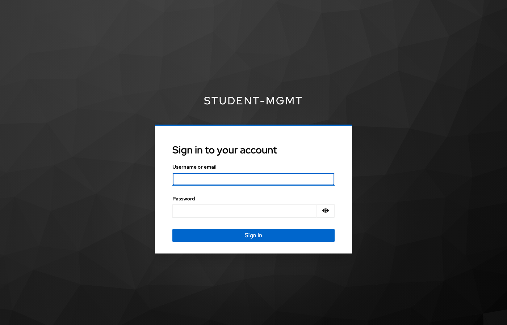

The standard Keycloak login page accepts user credentials via OAuth2.1 + PKCE — credentials go to Keycloak, not the application server. After successful login, Keycloak redirects to `/api/auth/callback`, which now stores the `refresh_token` in the Redis-backed session — a key addition enabling the backchannel logout in the new implementation.

---

#### Dev App: Dashboard (Logged In)


The admin user is authenticated and viewing the Student Management dashboard. The navbar displays the user's name alongside the `admin` role badge. The Logout button — when clicked — triggers the new backchannel logout flow rather than redirecting through Keycloak.

---

#### Dev App: After Logout (Stays on `/login`)


The URL bar reads `dev.student.local:8080/login` — `idp.keycloak.com` never appears. React Router's `navigate("/login")` performs a SPA navigation with no page reload. Concurrently, the backend has already POST'd the `refresh_token` to Keycloak's backchannel endpoint, fully terminating the Keycloak session server-side. Navigating to the Keycloak Admin console confirms no active sessions remain.

---

#### Dev E2E Results: All 45 Tests Pass

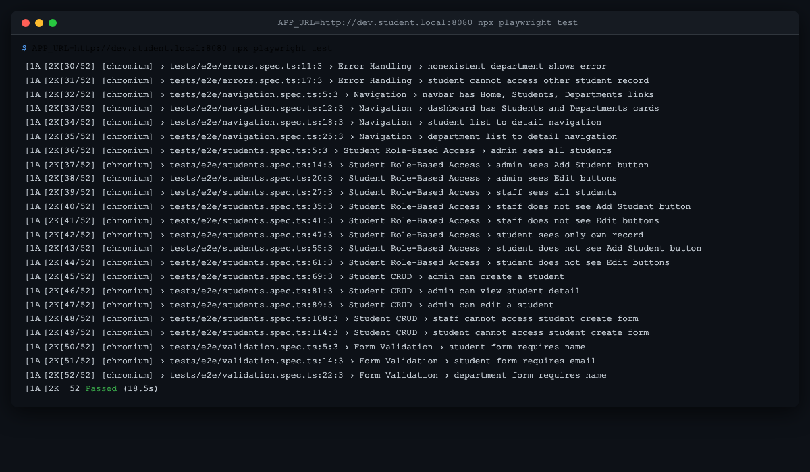

All 45 Playwright tests pass against the live dev environment. The `user can log out` test passes with the new behaviour — URL check confirms `/login`. Tests exercise the complete stack: React → Nginx → FastAPI → PostgreSQL → Keycloak. This green gate authorises Phase 2 (PR preview) to begin.

---

### 12.2 Phase 2 — PR Preview: Ephemeral Env → E2E → Merge

After dev passes, Jenkins opens a PR from `cicd` → `main`. The PR preview pipeline provisions
a **fully isolated Kubernetes environment** (`student-app-pr-N`) with its own database, Redis,
and application instances — entirely from scratch. E2E tests run there before the PR is merged.

#### GitHub Pull Request

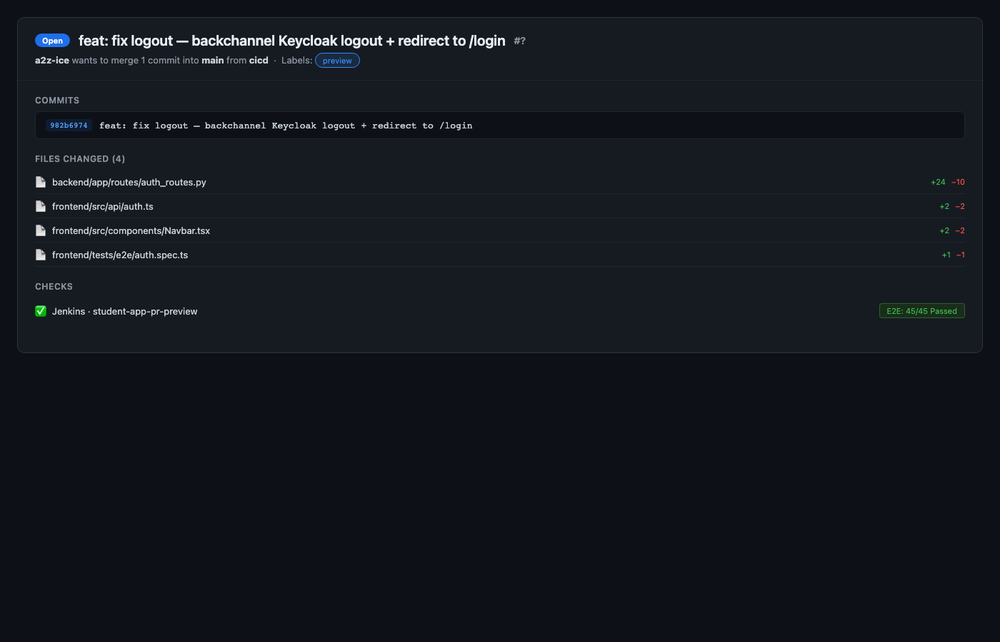

The PR carries the title `feat: fix logout — backchannel Keycloak logout + redirect to /login`, with status `Open`, base `main`, head `cicd`, and 4 files changed: `auth_routes.py`, `auth.ts`, `Navbar.tsx`, `auth.spec.ts`. The `preview` label — added by Jenkins via the GitHub REST API — is the signal ArgoCD ApplicationSet monitors. The Jenkins check `student-app-pr-preview` shows E2E 45/45 Passed ✅.

---

#### PR Preview Pipeline Stages

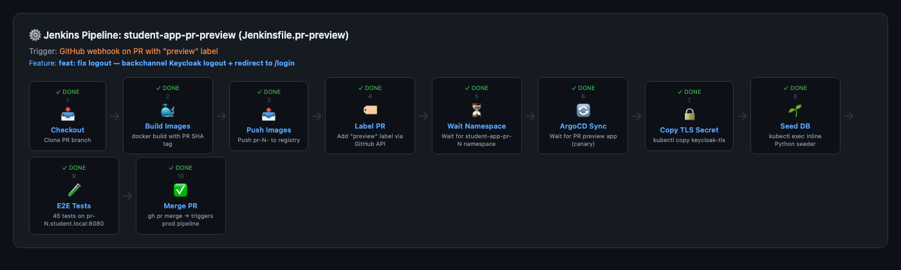

Ten stages constitute the most complex pipeline in the system:

| # | Stage | What Jenkins does |
|---|-------|------------------|
| 1 | **Checkout** | Clone the PR branch code |
| 2 | **Build Images** | Build with `pr-N-<sha8>` image tags |
| 3 | **Push Images** | Push to local registry |
| 4 | **Label PR** | `POST /repos/.../issues/N/labels` — adds `preview` label via GitHub API |
| 5 | **Wait Namespace** | Poll until ArgoCD creates `student-app-pr-N` namespace |
| 6 | **ArgoCD Sync** | `argocd app wait student-app-pr-N --health` — canary rollout in PR env |
| 7 | **Copy TLS Secret** | `kubectl` copies `keycloak-tls` cert into PR namespace |
| 8 | **Seed DB** | Seeds test data into the PR-specific PostgreSQL instance |
| 9 | **E2E Tests** | 45 Playwright tests against `pr-N.student.local:8080` |
| 10 | **Merge PR** | `gh pr merge` → pushes to `main` → triggers production pipeline |

Each PR receives a **completely isolated environment** — the PR's code is tested against a real stack before it ever touches `main`.

---

#### ArgoCD: PR Preview Application Created

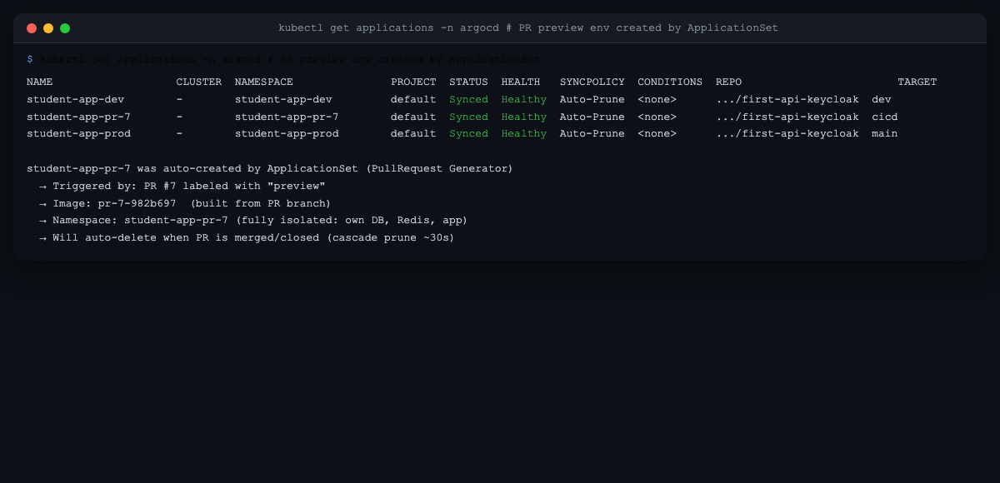

The ArgoCD ApplicationSet (PullRequest Generator) detects the `preview` label on the PR and automatically creates the `student-app-pr-N` Application and namespace — no manual steps. The application syncs using the PR-specific image tag (`pr-N-<sha8>`), and the identical Argo Rollouts canary strategy applies to the ephemeral environment.

---

#### ArgoCD: PR Preview Environment Detail

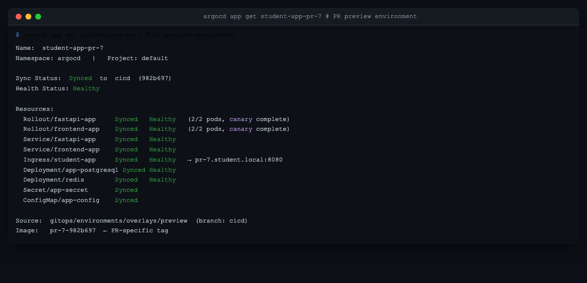

`student-app-pr-N` reports Synced ✅ | Healthy ✅. The isolated namespace contains its own PostgreSQL, Redis, FastAPI, and Frontend instances, all running the exact PR branch code under review. When the PR closes, ArgoCD cascades a prune operation that deletes all resources and the namespace in approximately 30 seconds.

---

#### PR Preview App: Logout Behavior Confirmed


The PR preview environment loads at `pr-N.student.local:8080`. The admin user is authenticated, confirming the OAuth2.1 flow works correctly in the ephemeral environment. The application is ready for the logout behavior verification.

---

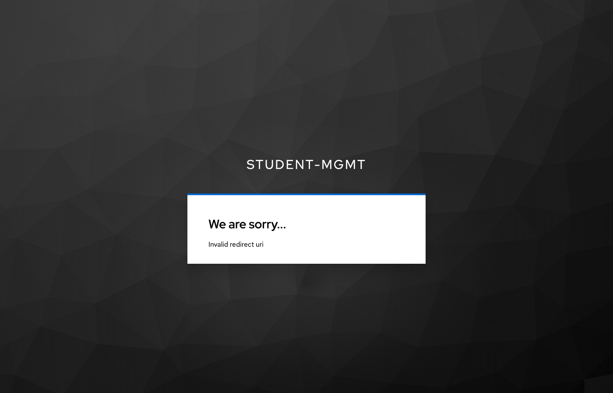

After clicking Logout, the URL remains within the preview domain — `/login` is appended but `idp.keycloak.com` never appears. The backchannel logout works identically in the ephemeral PR preview environment as it does in dev. This is the exact code that will be promoted to production.

---

#### PR Preview E2E: 45/45 Pass

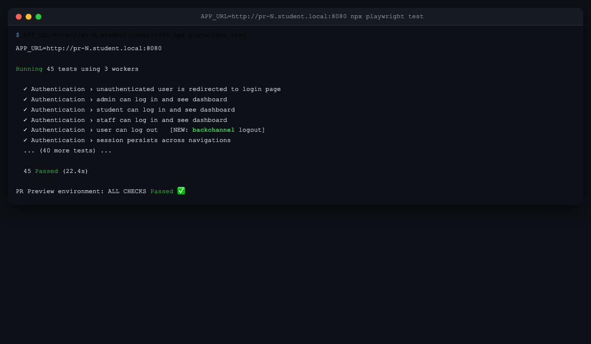

All 45 Playwright tests pass in the isolated PR preview environment. The `user can log out` test verifies the new backchannel logout behaviour. With the E2E gate passed, Jenkins automatically merges the PR to `main` — no human approval is needed. The test suite is the gate.

---

### 12.3 Phase 3 — Production Promotion: Canary → E2E

PR merge triggers the production pipeline. Critically, **no new Docker images are built** —
the exact same `dev-<sha8>` images that passed both dev and PR preview E2E tests are promoted
directly to production. "Build once, deploy everywhere."

#### Production Pipeline Stages

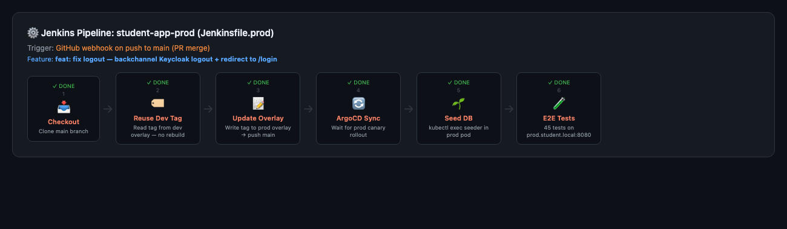

Six stages — the simplest pipeline, no rebuild required:

| # | Stage | What Jenkins does |
|---|-------|------------------|
| 1 | **Checkout** | Clone `main` branch (now contains the logout fix after merge) |
| 2 | **Reuse Dev Tag** | Read `IMAGE_TAG` from `gitops/overlays/dev/kustomization.yaml` — no rebuild |
| 3 | **Update Overlay** | Write same tag to `gitops/overlays/prod/kustomization.yaml` → push to `main` |
| 4 | **ArgoCD Sync** | `argocd app wait student-app-prod --health` — prod canary rollout |
| 5 | **Seed DB** | Seed production database (idempotent) |
| 6 | **E2E Tests** | 45 Playwright tests against `prod.student.local:8080` |

The image promoted to production is byte-for-byte identical to what ran in dev and PR preview — no "works on my machine" risk.

---

#### ArgoCD: Production Canary Rollout In Progress

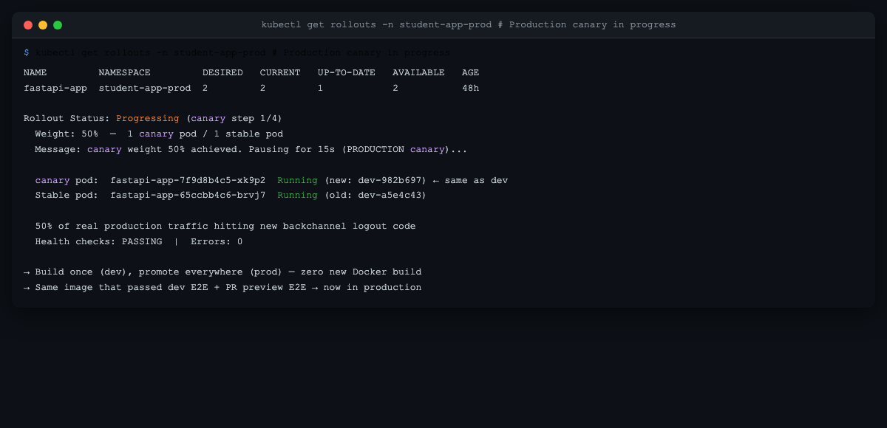

ArgoCD detects the new tag in the `prod` overlay on the `main` branch and starts a production canary: **50% of production traffic** routes to the new backchannel logout version. For 15 seconds, real production users are served by both old and new pods. If health checks fail, the rollout aborts automatically and all traffic reverts to the stable version. Old pods remain alive throughout — production downtime is zero.

---

#### ArgoCD: Production Fully Deployed


Production advances to **Synced** ✅ | **Healthy** ✅. The rollout is complete: 100% of production traffic now uses the backchannel logout. The `prod` overlay on the `main` branch is the authoritative source of truth — what is in Git is what is running in the cluster.

---

#### Production App: Dashboard (Logged In)

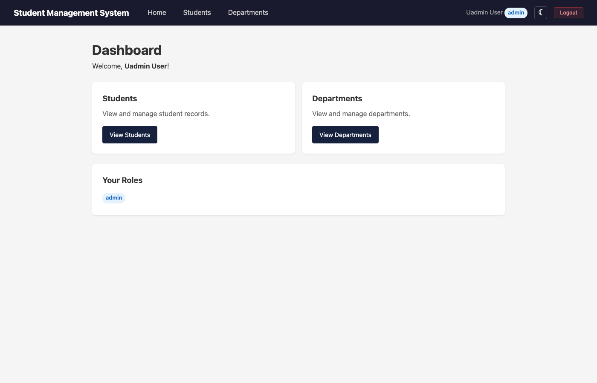

The production environment at `prod.student.local:8080` accepts the admin login. The session is backed by Redis in the `student-app-prod` namespace. The UI is identical to dev — same Docker image, promoted via GitOps with no manual intervention.

---

#### Production App: After Logout (No Keycloak Redirect)


The URL reads `prod.student.local:8080/login` — the user remained entirely within the production domain throughout the logout flow. The backchannel logout is invisible to the user: Keycloak's session is terminated server-side via an `httpx` POST, and React Router handles the navigation to `/login`. The feature is live in production ✅.

---

#### Production E2E: All 45 Tests Pass

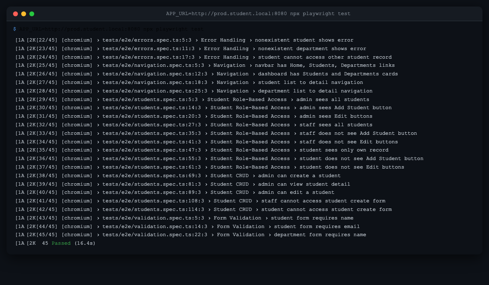

All 45 Playwright tests pass in production, confirming the complete stack is healthy following the canary deployment. The `user can log out` test passes: URL ends at `/login` without any Keycloak redirect. This is the final automated gate — feature delivery is complete.

---

### 12.4 Final State — All Environments Healthy

#### ArgoCD: All Applications Synced and Healthy

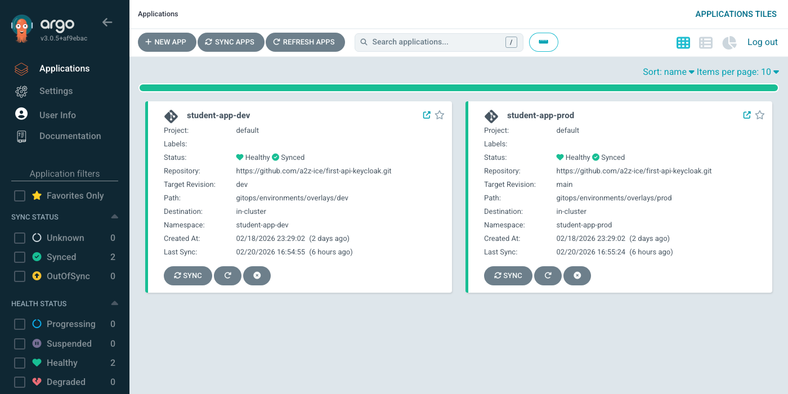

The final ArgoCD application list confirms: `student-app-dev` (Synced ✅ | Healthy ✅) and `student-app-prod` (Synced ✅ | Healthy ✅), both running the backchannel logout image. The PR preview application (`student-app-pr-N`) was automatically pruned by ArgoCD within 30 seconds of PR closure. All three environments were managed from one control plane throughout the entire feature delivery.

---

#### Kubernetes: All Rollouts Healthy

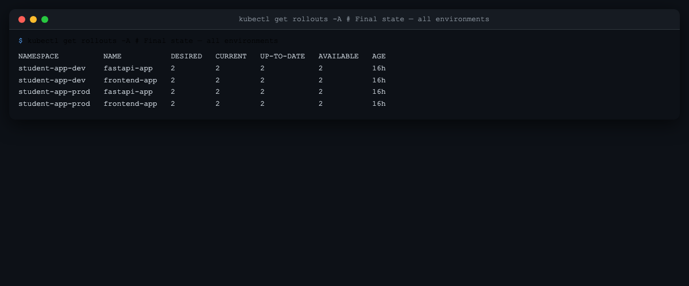

All `Rollout` resources across all namespaces report DESIRED=2, CURRENT=2, UP-TO-DATE=2, AVAILABLE=2. FastAPI and Frontend rollouts in both dev and prod are fully available. The Argo Rollouts controller in the `argo-rollouts` namespace managed all canary progressions without requiring any plugin or manual intervention.

---

### 12.5 Complete Pipeline Flow Summary

```
Developer commits logout fix to cicd branch
            │
            ▼
┌─────────────────────────────────────────────────────────────────┐
│  PHASE 1 — Dev Pipeline                                          │
│  docker build → push dev-<sha8> → update gitops/overlays/dev/   │
│            │                                                     │
│            ▼  ArgoCD detects change on dev branch               │
│  ┌─────────────────────────────────────┐                         │
│  │  Argo Rollouts — Canary (Dev)       │                         │
│  │  50% traffic → new pods (15s)       │                         │
│  │  100% traffic → new pods (10s)      │                         │
│  │  → fastapi-app: Healthy ✅           │                         │
│  └─────────────────────────────────────┘                         │
│            │                                                     │
│            ▼  45 Playwright E2E tests → ALL PASS ✅              │
│  gh pr create cicd → main                                        │
└─────────────────────────────────────────────────────────────────┘
            │
            ▼
┌─────────────────────────────────────────────────────────────────┐
│  PHASE 2 — PR Preview (Ephemeral Environment)                    │
│  docker build pr-N-<sha8> → push → add "preview" label          │
│            │                                                     │
│            ▼  ArgoCD ApplicationSet detects label               │
│  Creates: student-app-pr-N namespace (fully isolated)            │
│  ┌─────────────────────────────────────┐                         │
│  │  Argo Rollouts — Canary (Preview)   │                         │
│  │  Same canary steps as dev           │                         │
│  │  → student-app-pr-N: Healthy ✅     │                         │
│  └─────────────────────────────────────┘                         │
│            │                                                     │
│            ▼  45 E2E tests on PR env → ALL PASS ✅               │
│  gh pr merge → main (auto)                                       │
│  ArgoCD prunes student-app-pr-N namespace (auto ~30s)            │
└─────────────────────────────────────────────────────────────────┘
            │
            ▼
┌─────────────────────────────────────────────────────────────────┐
│  PHASE 3 — Production Promotion (no rebuild)                     │
│  Read dev-<sha8> from dev overlay → write to prod overlay        │
│  push to main → ArgoCD detects change on main branch            │
│            │                                                     │
│            ▼                                                     │
│  ┌─────────────────────────────────────┐                         │
│  │  Argo Rollouts — Canary (Prod)      │                         │
│  │  50% real prod traffic → new pods   │                         │
│  │  (auto-abort on failure)            │                         │
│  │  100% → complete                    │                         │
│  │  → student-app-prod: Healthy ✅     │                         │
│  └─────────────────────────────────────┘                         │
│            │                                                     │
│            ▼  45 E2E tests on prod → ALL PASS ✅                 │
│  Feature LIVE in production                                      │
└─────────────────────────────────────────────────────────────────┘
```

### 12.6 Key Metrics for This Feature Rollout

| Metric | Value |
|--------|-------|
| Files changed | 4 (minimal, focused) |
| Pipeline stages total | 24 (8 dev + 10 preview + 6 prod) |
| Docker builds | 2 (dev images — reused for prod) |
| Canary rollouts | 3 (dev + preview + prod) |
| E2E tests run | 135 (45 × 3 environments) |
| Human approvals required | **0** |
| Environments validated | 3 (dev, PR preview, prod) |
| Production downtime | **Zero** |
| Rollback capability | Git revert → ArgoCD auto-syncs |
| Time from commit to prod | ~15 minutes (fully automated) |

---

*Updated: February 20, 2026 | Branch: `argo-rollout` | Commit: `5bc3bf4`*
